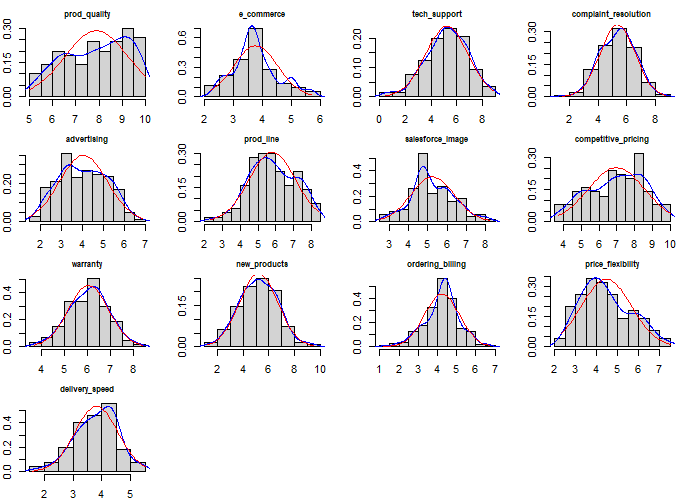

# R_CS_01
Statistical Data Analysis project in R

### Case-Study Title: Survey Analysis
### Data Analysis methodology: CRISP-DM
### Dataset: Customer survey of an USA paper company
### Case Goal: Which variables affect on business income variables?

Histogram of all 13 measuring perception variables in one plot

